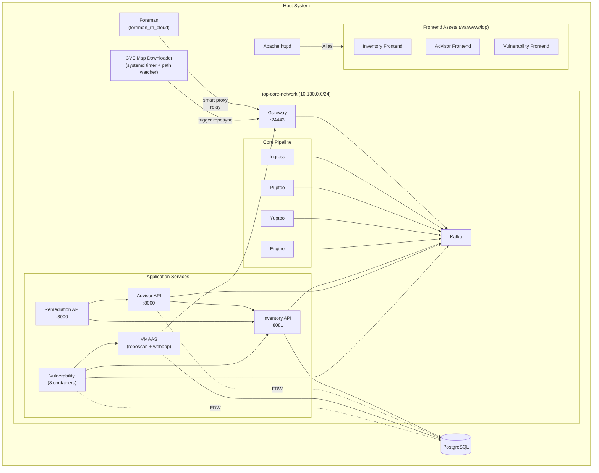
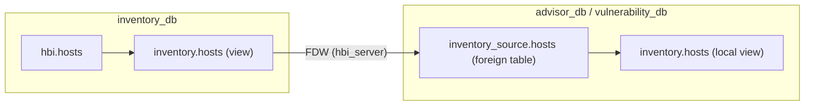

# IOP

IOP deploys the on-premise Insights services that provide advisor, vulnerability, and remediation capabilities integrated with Foreman.

## Enabling IOP

Add `iop` to `enabled_features` in your flavor configuration. IOP requires internal database mode (`database_mode: internal`).

The `iop` feature depends on `rh-cloud`, which installs the `foreman_rh_cloud` plugin into Foreman and `katello` as a transitive dependency.

## Architecture

IOP runs as a set of containerized services managed via podman quadlets on the `iop-core-network` (bridge, `10.130.0.0/24`). The gateway is registered as a Foreman smart proxy at `https://localhost:24443`.



### Data Flow

The core pipeline processes host data through an event-driven architecture using Kafka as the message broker:

1. Foreman uploads host archives to the **Ingress** endpoint via the smart proxy relay (gateway)
2. Ingress validates the upload and publishes to `platform.upload.announce`
3. Report processor consumes the upload:
   a. **Puptoo** extracts system facts and publishes to `platform.inventory.host-ingress`
   b. **Yuptoo** processes yum/package data
4. **Inventory** consumes report processor events, creates or updates host records in the inventory database, and publishes to `platform.inventory.events`
5. **Engine** consumes inventory events, runs Insights rule evaluation against the host data, and publishes results to `platform.engine.results`
6. **Advisor** consumes engine results to generate recommendations
7. **Vulnerability** consumes inventory events and engine results, evaluates hosts against VMAAS advisory data

Key Kafka topics:

| Topic | Producer | Consumer |
|-------|----------|----------|
| `platform.upload.announce` | Ingress | Puptoo, Yuptoo |
| `platform.inventory.host-ingress` | Puptoo | Inventory |
| `platform.inventory.events` | Inventory | Engine, Vulnerability listener |
| `platform.engine.results` | Engine | Advisor, Vulnerability listener |
| `vulnerability.evaluator.recalc` | Vulnerability | Vulnerability evaluator-recalc |
| `vulnerability.evaluator.upload` | Vulnerability | Vulnerability evaluator-upload |
| `vulnerability.grouper.inventory.upload` | Vulnerability | Vulnerability grouper |
| `vulnerability.grouper.advisor.upload` | Vulnerability | Vulnerability grouper |

### Services

| Service | Container(s) | Port | Description |
|---------|-------------|------|-------------|
| kafka | `iop-core-kafka` | 9092 (internal) | Message broker (KRaft mode, single-node) |
| ingress | `iop-core-ingress` | 8080 (internal) | Upload ingestion endpoint |
| puptoo | `iop-core-puptoo` | - | System facts processor |
| yuptoo | `iop-core-yuptoo` | - | Yum/package data processor |
| engine | `iop-core-engine` | - | Insights rules engine |
| gateway | `iop-core-gateway` | 127.0.0.1:24443 | nginx proxy, smart proxy relay to Foreman |
| inventory | `iop-core-host-inventory-migrate` (oneshot), `iop-core-host-inventory`, `iop-core-host-inventory-api`, `iop-core-host-inventory-cleanup` (timer) | 8081 (internal) | Host inventory with DB migration, MQ consumer, REST API, and periodic cleanup |
| advisor | `iop-service-advisor-backend-api`, `iop-service-advisor-backend-service` | 8000 (internal) | Advisor recommendations |
| remediation | `iop-service-remediations-api` | 3000 (host network) | Remediation playbook generation |
| vmaas | `iop-service-vmaas-reposcan`, `iop-service-vmaas-webapp-go` | - | Vulnerability metadata and advisory sync |
| vulnerability | 8 containers (see below) | 8443 (internal) | Vulnerability assessment pipeline |

#### Vulnerability containers

| Container | Type | Description |
|-----------|------|-------------|
| `iop-service-vuln-dbupgrade` | oneshot | Database schema migration |
| `iop-service-vuln-manager` | service | Main API endpoint |
| `iop-service-vuln-taskomatic` | service | Periodic job scheduler (stale_systems, delete_systems, cacheman) |
| `iop-service-vuln-grouper` | service | Groups uploads from inventory and advisor Kafka topics |
| `iop-service-vuln-listener` | service | Listens on `platform.inventory.events` and `platform.engine.results` |
| `iop-service-vuln-evaluator-recalc` | service | Recalculates vulnerability scores |
| `iop-service-vuln-evaluator-upload` | service | Evaluates new uploads against VMAAS data |
| `iop-service-vuln-vmaas-sync` | timer (4h) | Periodic sync from VMAAS webapp |

### Network

All IOP containers join the `iop-core-network` bridge network (`10.130.0.0/24`, gateway `10.130.0.1`). Containers communicate with each other by container name within this network.

Database connectivity uses `host.containers.internal:5432` to reach the host's PostgreSQL instance. SSL is disabled for these internal connections.

The gateway binds only to `127.0.0.1:24443` so it is not externally accessible.

### Smart Proxy Registration

After the gateway is deployed, the `iop_core` Ansible role registers it as a Foreman smart proxy named `iop-gateway` using the `theforeman.foreman.smart_proxy` Ansible module. The Ansible role uses Foreman's OAuth consumer key and secret for this registration step.

The gateway's nginx relay configuration proxies requests to `https://host.containers.internal` (the host Foreman instance), setting the `Host` header to the instance's FQDN.

### Systemd Integration

All IOP containers are `PartOf=foreman.target`, meaning they start and stop with the Foreman service group.

Patterns used:

- **Init containers** (database migrations): `Type=oneshot` with `RemainAfterExit=true`. Downstream services use `Requires=` and `After=` to depend on these.
- **Long-running services**: `Restart=on-failure` with `WantedBy=default.target foreman.target`
- **Periodic tasks**: systemd timers with `Persistent=true` and `RandomizedDelaySec`

Timers:

| Timer | Interval | Purpose |
|-------|----------|---------|
| `iop-core-host-inventory-cleanup.timer` | 24h | Host access tags cleanup |
| `iop-service-vuln-vmaas-sync.timer` | 4h | Vulnerability data sync from VMAAS |
| `iop-cvemap-download.timer` | 24h | CVE map XML download |

## Databases

IOP creates five PostgreSQL databases, all accessible to containers via `host.containers.internal:5432`:

| Database | User |
|----------|------|
| `inventory_db` | `inventory_admin` |
| `advisor_db` | `advisor_user` |
| `remediations_db` | `remediations_user` |
| `vmaas_db` | `vmaas_admin` |
| `vulnerability_db` | `vulnerability_admin` |

Passwords are auto-generated using Ansible's `password` lookup and stored as podman secrets.

### Foreign Data Wrappers

Advisor and vulnerability services use PostgreSQL foreign data wrappers (FDW) to query the inventory database directly, avoiding REST API overhead for bulk data access.

The reusable `iop_fdw` role sets up each FDW connection:

1. Enables the `postgres_fdw` extension on the consuming database
2. Creates a foreign server (`hbi_server`) pointing to the inventory database
3. Creates user mappings for both the service user and postgres
4. Imports the `inventory.hosts` view as a foreign table under an `inventory_source` schema
5. Creates a local `inventory.hosts` view pointing to the foreign table
6. Grants select permissions

The `inventory.hosts` view is created in the inventory database by the `iop_inventory` role. It maps HBI schema fields for use by consuming services.



## CVE Map Downloader

A non-containerized service that provides CVE map data to the VMAAS reposcan. Managed by three systemd units:

- `iop-cvemap-download.service` - oneshot download job
- `iop-cvemap-download.timer` - runs every 24 hours
- `iop-cvemap-download.path` - watches `/var/lib/foremanctl/iop/cvemap.xml` for changes (air-gapped mode)

### Online mode

Downloads `cvemap.xml` from `https://security.access.redhat.com/data/meta/v1/cvemap.xml` and writes it to `/var/www/html/pub/iop/data/meta/v1/cvemap.xml`.

### Offline mode

If `/var/lib/foremanctl/iop/cvemap.xml` exists on disk, the downloader uses it instead of fetching from the internet. The path watcher detects file changes and triggers the service automatically. This supports air-gapped deployments where the CVE map is provided manually. Override the location via `iop_cvemap_downloader_manual_file`.

### Reposync trigger

When the CVE map file changes, the downloader triggers a VMAAS reposync via `PUT https://localhost:24443/api/vmaas-reposcan/v1/sync` using client certificates. The trigger retries up to 5 times with exponential backoff.

## VEX Downloader

A non-containerized service that provides CSAF VEX (Vulnerability Exploitability eXchange) data to the vulnerability service, following the same pattern as the CVE Map Downloader. Managed by three systemd units:

- `iop-vex-download.service` - oneshot download job
- `iop-vex-download.timer` - runs every 24 hours
- `iop-vex-download.path` - watches `/var/lib/foremanctl/iop/vex-latest.tar.zst` for changes (air-gapped mode)

### Online mode

Downloads the latest `vex-latest.tar.zst` archive (and its `.asc` signature) from `https://security.access.redhat.com/data/csaf/v2/vex/` and writes it to `/var/www/html/pub/iop/data/csaf/v2/vex/`.

### Offline mode

If `/var/lib/foremanctl/iop/vex-latest.tar.zst` exists on disk, the downloader uses it instead of fetching from the internet. The path watcher detects file changes and triggers the service automatically. Override the location via `iop_vex_downloader_manual_file`.

## VMAAS-Katello Integration

VMAAS reposcan syncs its repository list from Katello (`SYNC_REPO_LIST_SOURCE=katello`) via the gateway at port 9090. VMAAS does not maintain its own repository list; it pulls from the content already managed by Katello.

The CVE map URL is served locally at `http://iop-core-gateway:9090/pub/iop/data/meta/v1/cvemap.xml`, provided by the CVE map downloader.

## Frontend Assets

Inventory, advisor, and vulnerability frontend assets are extracted from container images and served by Apache:

- Assets are deployed to `/var/www/iop/assets/apps/{inventory,advisor,vulnerability}`
- Apache serves them via `Alias` directives in `/etc/httpd/conf.d/05-foreman-ssl.d/`
- `ProxyPass ... !` prevents these paths from being proxied to Foreman
- Assets include gzip precompression support and 1-year cache headers

The extraction process for each frontend:

1. Pull image via quadlet image unit
2. Create a temporary container from the image
3. Copy assets from the container to the host path
4. Restore SELinux context
5. Remove the temporary container
6. Configure Apache alias and caching

No frontend containers remain running after deployment.

## Configuration

### Foreman Connection

| Variable | Default | Description |
|----------|---------|-------------|
| `iop_core_foreman_url` | `https://{{ ansible_facts['fqdn'] }}` | Foreman server URL |
| `iop_core_foreman_admin_username` | `admin` | Foreman admin username |
| `iop_core_foreman_admin_password` | `changeme` | Foreman admin password |
| `iop_core_foreman_oauth_consumer_key` | from Foreman config | OAuth key for smart proxy registration |
| `iop_core_foreman_oauth_consumer_secret` | from Foreman config | OAuth secret for smart proxy registration |

### Certificates

Gateway and service certificates use the default foremanctl CA infrastructure at `/var/lib/foremanctl/certs/`:

| Certificate | Path |
|-------------|------|
| Gateway server cert | `certs/localhost.crt` |
| Gateway server key | `private/localhost.key` |
| Gateway client cert | `certs/localhost-client.crt` |
| Gateway client key | `private/localhost-client.key` |
| CA | `certs/ca.crt` |
| CVE map downloader client cert | `certs/<fqdn>-client.crt` |
| CVE map downloader client key | `private/<fqdn>-client.key` |
| VMAAS client CA | `certs/ca.crt` |

The gateway stores its certificates as 6 podman secrets mounted into the nginx container.

### Container Images

All IOP images default to `quay.io/iop/<service>:foreman-3.18`. Each role exposes `iop_<role>_container_image` and `iop_<role>_container_tag` variables to override.

Kafka uses `quay.io/strimzi/kafka:latest-kafka-4.2.0`.

The `pull-images` playbook pre-pulls all IOP images when the feature is enabled, before deployment begins.

### Engine Rule Packages

The engine loads Python rule packages listed in `iop_engine_packages`. A separate `iop_engine_extra_packages` list (default: `[]`) is available for downstream deployments to add packages that are not present in the community images:

```yaml
iop_engine_extra_packages:
  - "prodsec.rules"
  - "telemetry.rules.plugins"
```

The engine maps `console.redhat.com` to `127.0.0.1` via container `/etc/hosts` to prevent cloud lookups.

## Backup and Restore

When IOP is enabled, `foremanctl backup` includes dumps of all five IOP databases:

- `iop_advisor.dump`
- `iop_inventory.dump`
- `iop_remediation.dump`
- `iop_vmaas.dump`
- `iop_vulnerability.dump`
