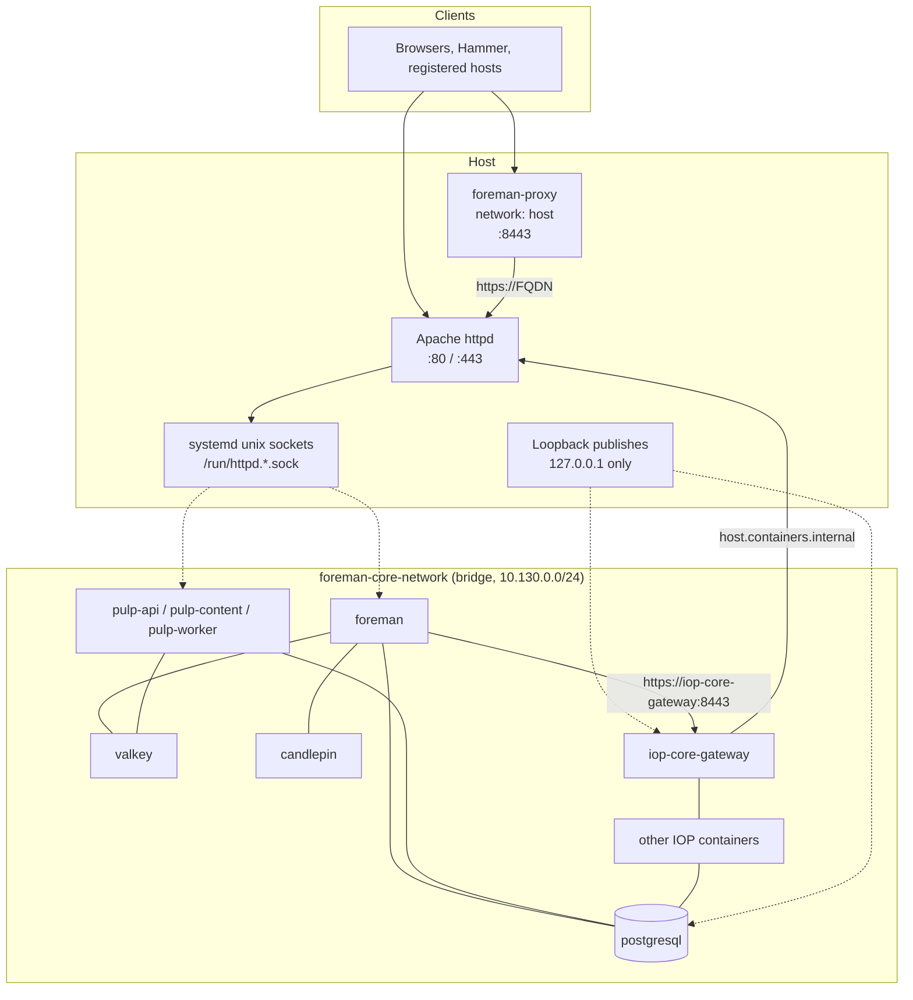
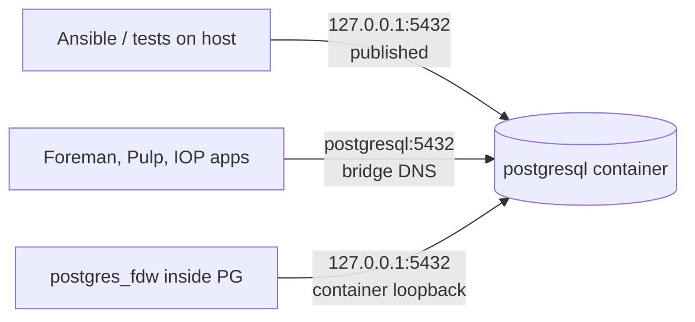

# Network Architecture

foremanctl splits networking into two planes: the **host** (public TLS, unix sockets, and a few loopback publishes) and a **shared Podman bridge** used for container-to-container traffic. Apache httpd is the public HTTP(S) front door. Application containers do not publish their APIs on all interfaces.

IOP service internals (Kafka topics, data flow) are covered in [IOP](iop.md). This document describes how packets move between the host, containers, and clients.

## Planes



| Plane | What lives here | How others reach it |
|-------|-----------------|---------------------|
| Host network | Apache httpd, Hammer, IOP downloaders, Foreman Proxy | Public `:80`/`:443` and proxy `:8443` |
| Host unix sockets | systemd socket units for Foreman and Pulp | Apache `ProxyPass` to `unix://...` |
| Host loopback | Published container ports bound to `127.0.0.1` | Host-side Ansible, tests, and tools |
| `foreman-core-network` | Foreman, Postgres, Valkey, Candlepin, Pulp, IOP | Container DNS name on `10.130.0.0/24` |

## Prerequisite: netavark

Deployments require Podman's **netavark** network backend (not CNI). `check_podman_network_backend` fails the install otherwise.

Netavark provides the bridge, gateway IP, and [aardvark-dns](https://github.com/containers/aardvark-dns) so containers resolve each other by container name.

## Shared bridge: `foreman-core-network`

The `foreman_core_network` role creates the network early in both `foremanctl deploy` and `foremanctl deploy-proxy`:

| Setting | Value |
|---------|-------|
| Name | `foreman-core-network` |
| Driver | `bridge` |
| Subnet | `10.130.0.0/24` |
| Gateway | `10.130.0.1` |

The subnet matches the former `iop-core-network`. The IOP gateway image uses `10.130.0.1` as its nginx resolver; that address is the bridge gateway, where aardvark-dns answers container-name lookups.

Containers on this network talk by **container name**, not by published host ports. Examples:

| Client | Target | Why |
|--------|--------|-----|
| Foreman, Candlepin, Pulp, IOP apps | `postgresql:5432` | Internal database |
| Foreman cache / Dynflow | `valkey:6379` | Redis-protocol cache and queues |
| Foreman (Katello) | `https://candlepin:23443/candlepin` | Entitlement service |
| IOP services | `iop-core-kafka:9092` | Message bus (`advertised.listeners` uses this name) |
| Foreman (smart proxy) | `https://iop-core-gateway:8443` | IOP gateway |
| VMAAS | `http://iop-core-gateway:9090` | Katello/CVE map via gateway |

Certificates include extra DNS names for names used over TLS on the bridge (`candlepin`, `iop-core-gateway`). See [Certificates](../user/certificates.md).

### Members

These containers join `foreman-core-network`:

- `postgresql` (internal database mode)
- `valkey`
- `candlepin`
- `foreman`, `dynflow-sidekiq@*`, `foreman-recurring@*`, `foreman-db-migrate`
- `pulp-api`, `pulp-content`, `pulp-worker@*`
- All IOP containers (Kafka, ingress, processors, gateway, inventory, advisor, remediation, VMAAS, vulnerability)

### Non-members

| Component | Network | Reason |
|-----------|---------|--------|
| Apache httpd | Host (RPM) | Public TLS terminator; proxies to unix sockets |
| Hammer | Host | CLI talking to `https://FQDN` |
| `foreman-proxy` | `network: host` | Bind host ports (`8443`, templates `:8000`) and host-level DHCP/TFTP/DNS |
| IOP frontends | None (extracted files) | Served by Apache aliases under `/var/www/iop` |
| IOP CVE map / VEX downloaders | Host systemd | Fetch files and call the gateway loopback publish |

## Host to container

### Unix sockets (Foreman and Pulp)

Foreman and Pulp do not publish HTTP ports. systemd socket units listen on the host and pass the connection into the container (`sdnotify` + `Requires=<name>.socket`):

| Socket unit | ListenStream | Apache backend |
|-------------|--------------|----------------|
| `foreman.socket` | `/run/httpd.foreman.sock` | `unix:///run/httpd.foreman.sock\|http://foreman` |
| `pulp-api.socket` | `/run/httpd.pulp-api.sock` | `unix:///run/httpd.pulp-api.sock\|http://pulpcore-api` |
| `pulp-content.socket` | `/run/httpd.pulp-content.sock` | `unix:///run/httpd.pulp-content.sock\|http://pulpcore-content` |

Apache `ProxyPass` sends `/pulp/...` to the Pulp sockets and everything else (on a Foreman server) to the Foreman socket. SELinux `daemons_enable_cluster_mode` is enabled so httpd can use those unix sockets. `httpd.service` is ordered `After=` / `Wants=` `foreman.socket`.

Socket units are owned by `apache` with mode `0600`, so only the host httpd can connect.

### Loopback publishes

A published port is a host bind of `container_port` onto `127.0.0.1`. It is not reachable from other machines.

| Container | Production publish | Purpose |
|-----------|--------------------|---------|
| `postgresql` | `127.0.0.1:5432:5432` | Ansible `community.postgresql` modules, FDW setup, tests |
| `iop-core-gateway` | `127.0.0.1:24443:8443` | Host-side tools (CVE map reposync trigger) |

Valkey and Candlepin are **not** published in production. They are reachable only on the bridge (`valkey:6379`, `candlepin:23443`). Tests assert those ports are absent from `podman port` and from `0.0.0.0` / `[::]` listeners.

Postgres is published on IPv4 loopback only (`127.0.0.1`, not `::1` or `0.0.0.0`).

### PostgreSQL from three vantage points



- **Host processes** use the published port (`127.0.0.1:5432`). Ansible roles use `database_management_host`, which resolves to that address in internal mode.
- **Peer containers** use `postgresql:5432` on `foreman-core-network`.
- **Foreign data wrappers** (advisor and vulnerability databases) store `host=127.0.0.1`. That address is interpreted *inside* the Postgres container, so FDW connections stay on the same server and do not hairpin through the published host port.

## Container to host

Containers reach host services at `host.containers.internal` (the bridge gateway from the container's point of view).

The IOP gateway nginx relay uses this to call Foreman through Apache:

```
proxy_pass https://host.containers.internal;
```

Foreman itself is not listening on a container IP for HTTPS; Apache on the host is. The gateway therefore leaves the bridge, hits the host, and Apache forwards the request into the Foreman unix socket.

Host-side IOP timers (CVE map, VEX) call the gateway at `https://localhost:24443` (the loopback publish), not via container DNS.

## Public entry points

| Listener | Process | Audience |
|----------|---------|----------|
| `:80` / `:443` | Apache httpd | UI, API, Pulp content, `/pub` |
| `:8443` | `foreman-proxy` (host network) | Smart-proxy clients, Capsule/proxy registration |

Nothing else is intended to be reachable off-host. Application databases, Valkey, Candlepin, Kafka, and IOP APIs stay on the bridge or on loopback.

On a **proxy** (Capsule) node, Apache still terminates TLS and proxies Pulp locally, but `/rhsm` and selected Foreman routes are proxied to the server FQDN (`httpd_foreman_url`) rather than to a local Foreman socket. SELinux `httpd_can_network_relay` is enabled for that remote relay.

## External database mode

When `database_mode: external`, the `postgresql` container is not deployed. Foreman, Candlepin, and Pulp use `--database-host` (and related SSL flags). Those containers still sit on `foreman-core-network` and reach the remote server through the bridge's default NAT/route.

IOP requires internal database mode and is skipped when the database is external.

Ansible connectivity checks run **from the host**, so they use `database_management_host` (`127.0.0.1` in internal mode via the published port, or the same value as `database_host` in external mode). Container connection strings use `database_host` (`postgresql` internally, or the remote hostname externally), not the management host, except where noted above for FDW.

## Development (`forge deploy-dev`)

In the development environment Foreman runs on the host (`bundle exec`), not in the `foreman` container. Extra loopback publishes exist so that host-side Rails can reach services that production talks to by container name:

| Extra publish | Host use |
|---------------|----------|
| `127.0.0.1:5432:5432` | Rails database.yml (also present in production) |
| `127.0.0.1:6379:6379` | Rails cache / Dynflow |
| `127.0.0.1:23443:23443` | Katello → Candlepin |

IOP smart-proxy registration is overridden to `https://localhost:24443` because the registering Foreman process is on the host, not on `foreman-core-network`. Production registers `https://iop-core-gateway:8443` so the Foreman *container* can reach the gateway by DNS name with a matching TLS certificate.
