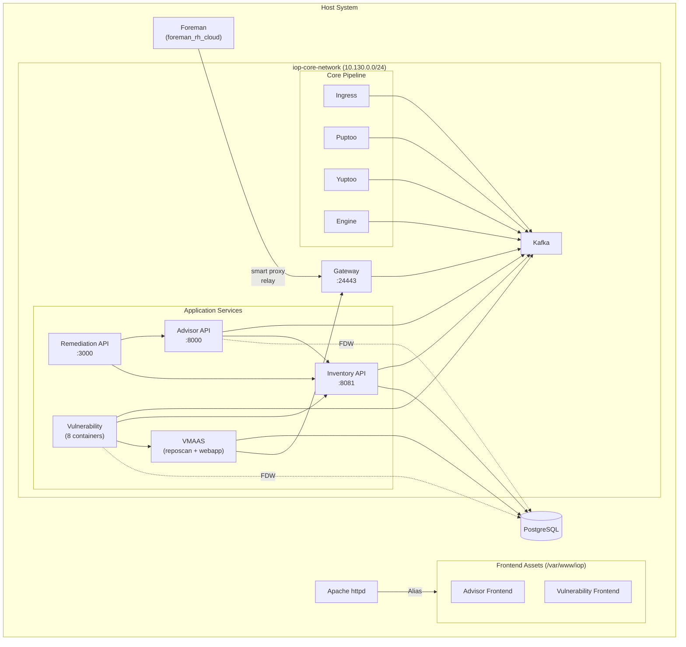

# IOP

IOP deploys the on-premise Insights services that provide advisor, vulnerability, and remediation capabilities integrated with Foreman.

## Enabling IOP

Add `iop` to `enabled_features` in your flavor configuration. IOP requires internal database mode (`database_mode: internal`).

The `iop` feature depends on `rh-cloud`, which installs the `foreman_rh_cloud` plugin into Foreman and `katello` as a transitive dependency.

## Architecture

IOP runs as a set of containerized services managed via podman quadlets on the `iop-core-network` (bridge, `10.130.0.0/24`). The gateway is registered as a Foreman smart proxy at `https://localhost:24443`.

### Services

| Service | Container(s) | Port | Description |
|---------|-------------|------|-------------|
| kafka | `iop-core-kafka` | 9092 (internal) | Message broker (KRaft mode) |
| ingress | `iop-core-ingress` | 8080 (internal) | Upload ingestion endpoint |
| puptoo | `iop-core-puptoo` | - | Puppet/system facts processor |
| yuptoo | `iop-core-yuptoo` | - | Yum/package data processor |
| engine | `iop-core-engine` | - | Insights rules engine |
| gateway | `iop-core-gateway` | 127.0.0.1:24443 | nginx proxy, smart proxy relay to Foreman |
| inventory | `iop-core-host-inventory`, `iop-core-host-inventory-api` | 8081 (internal) | Host inventory with MQ consumer and REST API |
| advisor | `iop-service-advisor-backend-api`, `iop-service-advisor-backend-service` | 8000 (internal) | Advisor recommendations |
| remediation | `iop-service-remediations-api` | 3000 (host network) | Remediation playbook generation |
| vmaas | `iop-service-vmaas-reposcan`, `iop-service-vmaas-webapp-go` | - | Vulnerability metadata and advisory sync |
| vulnerability | 8 containers (manager, taskomatic, grouper, listener, evaluators, vmaas-sync) | 8443 (internal) | Vulnerability assessment pipeline |

### Frontend Assets

Advisor and vulnerability frontend assets are extracted from container images and served by Apache:

- Assets are deployed to `/var/www/iop/assets/apps/{advisor,vulnerability}`
- Apache serves them via `Alias` directives in `/etc/httpd/conf.d/05-foreman-ssl.d/`
- Assets include gzip precompression support and 1-year cache headers

### Databases

IOP creates five PostgreSQL databases, all accessible to containers via `host.containers.internal:5432`:

| Database | User |
|----------|------|
| `inventory_db` | `inventory_admin` |
| `advisor_db` | `advisor_user` |
| `remediations_db` | `remediations_user` |
| `vmaas_db` | `vmaas_admin` |
| `vulnerability_db` | `vulnerability_admin` |

Advisor and vulnerability services use PostgreSQL foreign data wrappers (FDW) to query the inventory database directly.

## Configuration

### Foreman Connection

Set in the playbook vars or inventory to match your Foreman deployment:

| Variable | Default | Description |
|----------|---------|-------------|
| `iop_core_foreman_url` | `https://{{ ansible_facts['fqdn'] }}` | Foreman server URL |
| `iop_core_foreman_admin_username` | `admin` | Foreman admin username |
| `iop_core_foreman_admin_password` | `changeme` | Foreman admin password |

### Certificates

Gateway certificates are configured per certificate source:

**Default certificates** (`certificate_source: default`):
- Server: `/root/certificates/certs/localhost.crt`
- Client: `/root/certificates/certs/localhost-client.crt`
- CA: `/root/certificates/certs/ca.crt`

**Installer certificates** (`certificate_source: installer`):
- Server: `/root/ssl-build/localhost/localhost-iop-core-gateway-server.crt`
- Client: `/root/ssl-build/localhost/localhost-iop-core-gateway-client.crt`
- CA: `/root/ssl-build/katello-default-ca.crt`

### Container Images

All IOP images default to `quay.io/iop/<service>:foreman-3.16`. Each role exposes `iop_<role>_container_image` and `iop_<role>_container_tag` variables to override.
